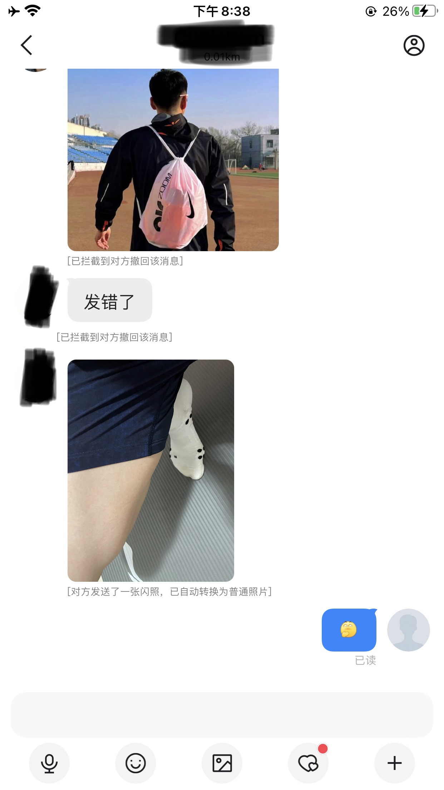

# bld-tweak
 
## 功能   

* [x] 消息防撤回     
* [x] 闪照自动转普通照片     

效果如下图：  



## 缺陷：

- ipa重新签名后不支持苹果服务器的apn消息推送，具体表现为：app切换到后台运行将收不到任何消息提醒，需打开app才能接收到消息。（该问题不是代码bug，目前没有好的解决方案，理论上在ios系统上安装任何重签名的应用都有该问题）

## 使用：   

1.开发者： 
    在工程根目录下执行```make```指令即可编译出dylib ，或直接使用工程目录下已经编译好的dylib ```.theos/obj/debug/bldhelper.dylib```，然后使用ipa打包工具注入到砸壳后的原版ipa中重新打包即可。

   注：ipa砸壳以及dylib注入请自行Google。

2.普通用户：   
    由于打包ios应用需要苹果的开发者证书，苹果开发者账号价格为$99/年 ，作者暂不提供已签名的ipa和安装地址，如有需要请自行在某宝、某鱼购买第三方签名服务。
    


### 请我喝杯 ☕️     
  如果你觉得本项目不错的话，可以请作者喝杯咖啡！
 
 

